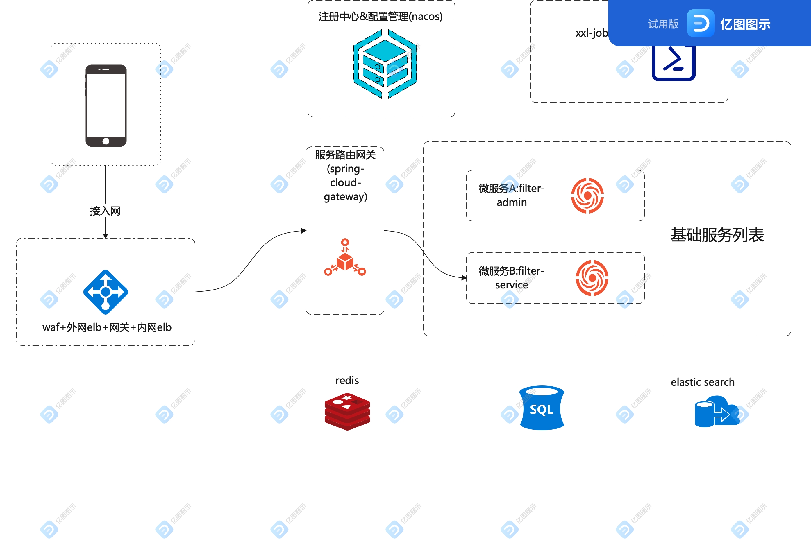

#dilidili
java练手项目，主要目的是搭建一个包含生产大多数能力的项目结构。

业务网关：spring-cloud-gateway
服务注册&服务发现：nacos
配置中心：nacos
业务框架：spring+spring mvc+mybatis-plus
定时任务管理：xxl-job
数据库：mysql
缓存：redis
请求数据存储：elastic-search (todo)
服务间调用：dubbo (todo)
服务部署：docker+k8s

系统架构(超简化版):

